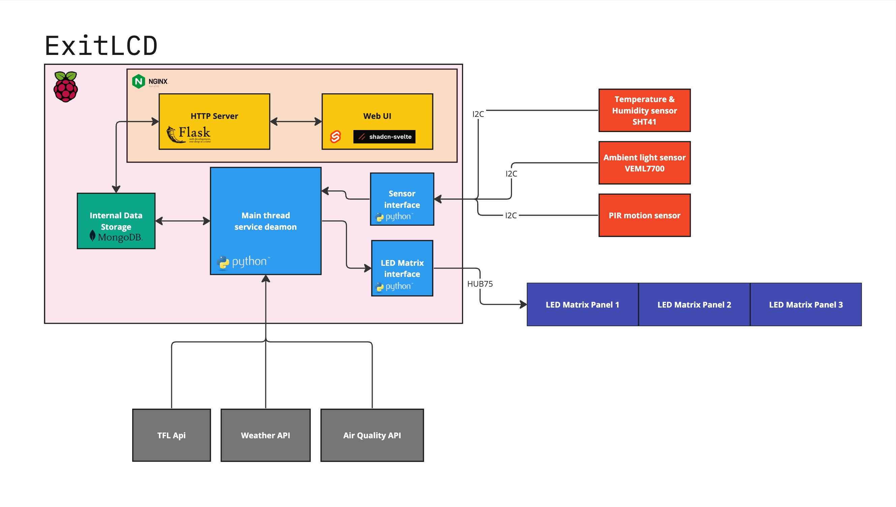

# ExitLCD

ExitLCD is a project designed to offer valuable real-time information at a glance. With a focus on convenience and practicality, ExitLCD aggregates data on local traffic conditions, weather updates, air quality, and more onto a 3 module LED matrix display that is located above the main door. By combining various APIs and sensors, ExitLCD delivers key information to residents, making it easier to plan their day efficiently.

### To Do List
- [x] Design the project architecture
- [ ] Complete hardware prototype
- [ ] Implement sensor interface
- [ ] Configure Nginx
- [ ] Configure Flask server
- [ ] Configure database
- [ ] Implement main service deamon
- [ ] Connect to TFL API
- [ ] Connect to Weather API
- [ ] Connect to Air Quality API
- [ ] Implement display interface
- [ ] Implement web UI

### Project Infrastructure

